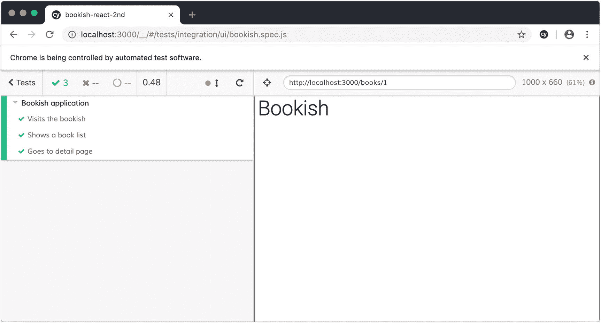
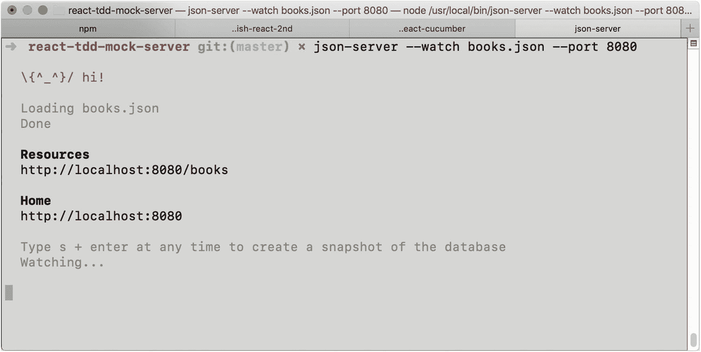
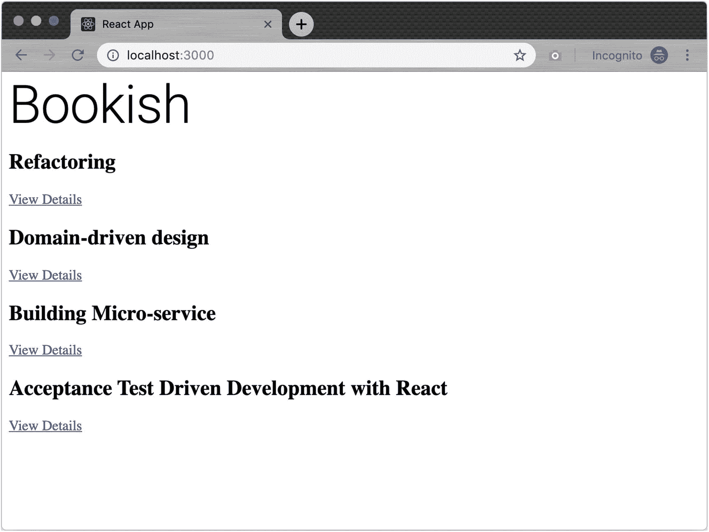
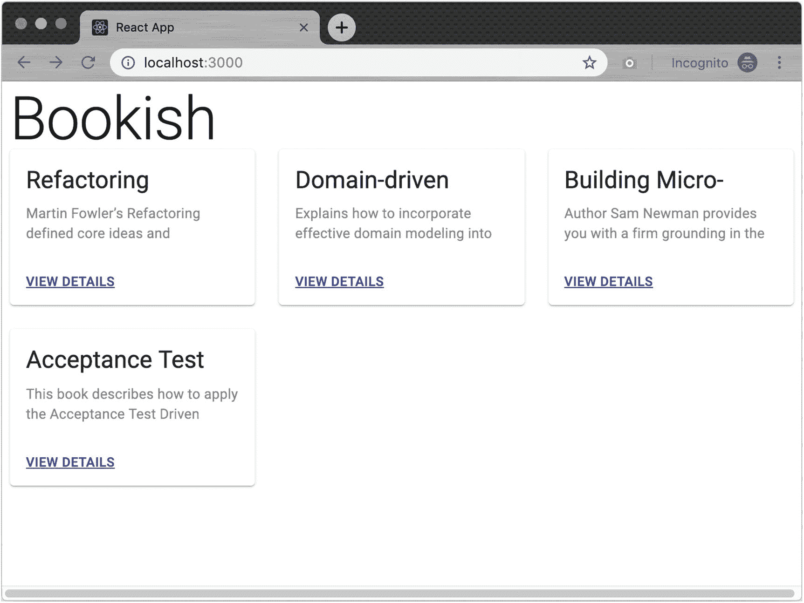
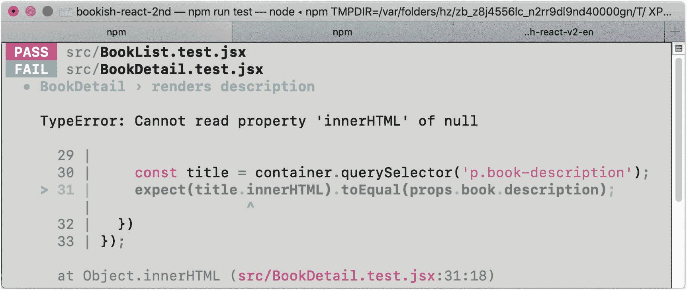

# 六、实现图书详细视图

对于图书列表中的每本书，我们希望将其名称显示为超链接，这样当用户单击它时，浏览器将导航到详细页面。详细页面将包含特定于每本书的内容，包括书名、封面图片、描述、评论等等。

## 验收测试

在我们的`bookish.spec.js`中，我们可以将这个需求描述为验收测试:

```jsx
it('Goes to the detail page', () => {
  cy.visit('http://localhost:3000/');
  cy.get('div.book-item').contains('View Details').eq(0).click();
  cy.url().should('include', '/books/1');
});

```

运行测试，它会失败。

### 链接到详细页面

那是因为我们还没有一条`/books`路线，我们也没有链接。为了使测试通过，在`BookList`组件中添加一个超链接:

```jsx
     {
       books.map(book => (<div className='book-item' key={book.id}>
         <h2 className='title'>{book.name}</h2>
+        <a href={`/books/${book.id}`}>View Details</a>
       </div>))
     }

```

### 验证详细页面上的图书标题

然后，为了确保页面在导航后显示预期的内容，我们需要在`bookish.spec.js`中添加一行:

```jsx
  it('Goes to the detail page', () => {
     cy.visit('http://localhost:3000/');
     cy.get('div.book-item').contains('View Details').eq(0).click();
     cy.url().should('include', '/books/1');
+    cy.get('h2.book-title').contains('Refactoring');
  });

```

该检查页面有一个`.book-title`部分，它的内容是`Refactoring`。测试再次失败；让我们通过在应用中添加客户端路由来解决这个问题。

正如您所看到的，这里有一个页面导航:当用户点击一个`button`时，将能够跳转到`detail page`。这意味着我们需要某种机制来维护路由。

### 前端路由

我们需要添加`react-router`和`react-router-dom`作为依赖项，它们为我们提供了客户端路由机制:

```jsx
npm install react-router react-router-dom

```

在`index.js`中，我们导入`BrowserRouter`并将其包裹在`<App />`周围。这意味着整个应用可以共享全局`Router`配置。

```jsx
+import {BrowserRouter as Router} from 'react-router-dom'
+
-ReactDOM.render(<App />, document.getElementById('root'));
+ReactDOM.render(<Router>
+  <App />
+</Router>, document.getElementById('root'));

```

然后我们在`App.js`中定义两条路线:

```jsx
+import {Route, Switch} from 'react-router-dom';
 import BookListContainer from './BookListContainer';
+import BookDetailContainer from './BookDetailContainer';

 const App = () => {
   return (
@@ -8,7 +10,10 @@ const App = () => {
       <Typography variant='h2' component='h2' data-test='heading'>
       Bookish
       </Typography>
-      <BookListContainer/>
+      <Switch>
+        <Route exact path='/' component={BookListContainer} />
+        <Route path='/books/:id' component={BookDetailContainer} />
+      </Switch>
     </div>
   );
 }

```

通过这些路径，当用户访问根路径`/`时，组件`BookListContainer`将被呈现。当访问`/books/123`时，将显示`BookDetailContainer`。

#### `BookDetailContainer`组件

最后，我们需要创建一个新文件`BookDetailContainer.js`。它将与第一版`BookListContainer.js`非常相似，除了这本书的`id`将作为`match.params.id`通过`react-router`。一旦我们有了图书 id，我们就可以发送一个 HTTP 请求来加载图书的详细信息:

```jsx
```js BookDetailContainer.js

import React, {useEffect, useState} from ‘react’
import axios from ‘axios’
const BookDetailContainer = ({match}) => { const [id, _] = useState(match.params.id); const [book, setBook] = useState({});
useEffect(() => { const fetchBook = async () => { const book = await axios.get(http://localhost:8080/books/${id}); setBook(book.data); };
fetchBook();
}, [id]);
return (
<h2 className='book-title'>{book.name}</h2>
) }
export default BookDetailContainer ```jsx

```

很好，功能测试现在通过了(图 [6-1](#Fig1) )。



图 6-1

图书详细页的验收测试

#### 一般化`useRemoteService`钩子

然而，数据获取过程可以改进。是时候让我们重构`useRemoteService`来适应新的需求了。因为我们已经准备好了更高级别的测试，所以我们可以自信地做出一些改变。

```jsx
-export const useRemoteService = (initial) => {
+export const useRemoteService = (url, initialData) => {
   const [data, setData] = useState(initialData);
   const [loading, setLoading] = useState(false);
   const [error, setError] = useState(false);

       setLoading(true);

       try {
-        const res = await axios.get('http://localhost:8080/books');
+        const res = await axios.get(url);
         setData(res.data);
       } catch (e) {
         setError(true);

```

我们将硬编码的`url`作为参数移出，在调用位置，简单地说

```jsx
const {data, loading, error} = useRemoteService('http://localhost:8080/books', []);

```

#### 用新挂钩简化`BookDetailContainer`

对于`BookDetailContainer`，它可以简化为

```jsx
import React from 'react'
import {useRemoteService} from './hooks';

const BookDetailContainer = ({match}) => {
  const {data} = useRemoteService(`http://localhost:8080/books/${match.params.id}`, {});

  return (<div className='detail'>
    <h2 className='book-title'>{data.name}</h2>
  </div>)
};

export default BookDetailContainer

```

代码现在看起来干净多了。

## 单元测试

在端到端测试中，我们只需确保细节页面中有一个`title`。如果我们在页面上添加更多的细节，比如`description`和`book cover`，我们会在更低层次的测试——单元测试中检查它们。单元测试运行速度快，比端到端测试检查更多的具体细节，如果出现问题，开发人员更容易调试。

### 重构

#### 提取表示组件

尽管在`BookDetailContainer`中只有一行来呈现细节，但是将该行提取到一个单独的组件中是一个好主意——我们称之为`BookDetail`:

```jsx
import React from 'react';

const BookDetail = ({book}) => {
  return (<div className='detail'>
    <h2 className='book-title'>{book.name}</h2>
  </div>)
}

export default BookDetail;

```

`BookDetailContainer`那么可以简化为

```jsx
const BookDetailContainer = ({match}) => {
  const {data} = useRemoteService(`http://localhost:8080/books/${match.params.id}`, {});
  return (<BookDetail book={data}/>);
};

```

现在让我们检查所有的测试，功能测试都通过了，但是根据您使用的 react-router 和 react-testing-library 的版本，您的单元测试可能会显示以下错误消息:

```jsx
● BookList › render books

Invariant failed: You should not use <Link> outside a <Router>

```

#### `MemoryRouter`用于测试

为了解决这个问题，我们需要通过提供一个`<MemoryRouter>`来稍微修改一下`BookList.test.js`:

```jsx
 import BookList from './BookList';

+import {MemoryRouter as Router} from 'react-router-dom';
+
+const renderWithRouter = (component) => {
+  return {...render(<Router>
+      {component}
+    </Router>)}
+};
+

```

我们在`render`中添加了一个包装器。这将把您传入的任何组件包装在一个`MemoryRouter`中。**然后**我们可以在所有需要渲染`Link`的测试中调用`renderWithRouter`而不是`render`:

```jsx
it('render books', () => {
  const props = {
    books: [
      { 'name': 'Refactoring', 'id': 1 },
      { 'name': 'Domain-driven design', 'id': 2 },
    ]
  };
  const { container } = renderWithRouter(<BookList {...props} />);
  const titles = [...container.querySelectorAll('h2')].map(x => x.innerHTML);
  expect(titles).toEqual(['Refactoring', 'Domain-driven design']);
})

```

### 图书详细信息页面

#### 书名

现在，我们可以在文件`BookDetail.test.js`中快速添加单元测试，以便驱动实现:

```jsx
describe('BookDetail', () => {
  it('renders title', () => {
    const props = {
      book: {
        name: 'Refactoring'
      }
    };

    const {container} = render(<BookDetail {...props} />);

    const title = container.querySelector('.book-title');
    expect(title.innerHTML).toEqual(props.book.name);
  })
});

```

这个测试将会通过，因为我们已经呈现了`name`字段。

#### 书籍描述

让我们再添加一些字段:

```jsx
it('renders description', () => {
  const props = {
    book: {
      name: 'Refactoring',
      description: "Martin Fowler's Refactoring defined core ideas and techniques " +
        "that hundreds of thousands of developers have used to improve " +
        "their software."
    }
  };

  const { container } = render(<BookDetail {...props} />);

  const description = container.querySelector('p.book-description');
  expect(description.innerHTML).toEqual(props.book.description);
})

```

一个简单的实现如下所示:

```jsx
 const BookDetail = ({book}) => {
   return (<div className='detail'>
     <h2 className='book-title'>{book.name}</h2>
+    <p className='book-description'>{book.description}</p>
   </div>)
 }

```

所有测试现在都以漂亮的绿色通过了！让我们后退一步，看看我们是否能把代码库做得更好一点。我注意到的一件事是，随着我们创建更多的文件，整个项目结构有点爆炸。

### 文件结构

我们的文件结构非常扁平——根本没有层次结构，因为所有文件都在一个文件夹中。那是代码的味道。很难找到我们想要的东西。让我们重组。

目前，我们的文件如下所示:

```jsx
src
├── App.js
├── BookDetail.jsx
├── BookDetail.test.jsx
├── BookDetailContainer.jsx
├── BookList.jsx
├── BookList.test.jsx
├── BookListContainer.jsx
├── hooks.js
└── index.js

```

有多种方法可以将应用分割成模块并组织它们。在尝试了各种项目的不同组合后，我发现用`feature`分割应用对我来说是最有意义的。

#### 模块化

所以现在，让我们定义两个独立的文件夹:`BookDetail`和`BookList`分别用于特性一和特性二。

```jsx
src
├── App.js
├── BookDetail
│   ├── BookDetail.jsx
│   ├── BookDetail.test.jsx
│   └── BookDetailContainer.jsx
├── BookList
│   ├── BookList.jsx
│   ├── BookList.test.jsx
│   └── BookListContainer.jsx
├── hooks.js
└── index.js

```

这是很有条理的，读者很容易找到需要更改的组件。

## 测试数据

您可能会发现为功能测试清理所有数据有点棘手。而当你想手动检查应用在浏览器中的样子时，根本没有数据。

让我们通过为`json-server`引入另一个`database`文件来解决这个问题:

```jsx
{
  "books": [
    {"name": "Refactoring", "id": 1, "description": "Martin Fowler's Refactoring defined core ideas and techniques that hundreds of thousands of developers have used to improve their software."},
    {"name": "Domain-driven design", "id": 2, "description": "Explains how to incorporate effective domain modeling into the software development process."},
    {"name": "Building Microservices", "id": 3, "description": "Author Sam Newman provides you with a firm grounding in the concepts while diving into current solutions for modeling, integrating, testing, deploying, and monitoring your own autonomous services."},
    {"name": "Acceptance Test Driven Development with React", "id": 4, "description": "This book describes how to apply the Acceptance Test Driven Development when developing a Web Application named bookish with React / Redux and other tools in react ecosystem."}
  ]
}

```

并将内容作为`books.json`保存在`stub-server`文件夹中。现在，更新`package.json`中的`stub-server`脚本:

```jsx
json-server --watch books.json --port 8080

```

并运行服务器(图 [6-2](#Fig2) ): `npm run stub-server`。



图 6-2

用假数据运行我们的存根服务器

记住在这里也要运行端到端测试。当我们改变书单中的预期数据时，我们也需要改变测试的预期。由于服务器正在模拟所有的数据，您会注意到此时我们不需要 beforeEach 和 afterEach。

## 用户界面优化

我们现在已经完成了两个令人兴奋和具有挑战性的功能。不过用户界面有点平淡(图[6-3](#Fig3))；让我们添加一些造型。



图 6-3

Bookish 的用户界面草稿

Material-UI 提供了许多基本的和更高级的 UI 组件，以及其他助手，比如一个`responsive`网格系统。

### 使用`Grid`系统

在我们的例子中，让我们为我们的`BookList`实现`Grid`和`Card`组件:

```jsx
import React from 'react';
+ import {
+   Button,
+   Card,
+   CardActionArea,
+   CardActions,
+   CardContent,
+   Grid,
+   Typography,
+ } from '@material-ui/core';
import { Link } from 'react-router-dom';

const BookList = ({ loading, error, books }) => {
  const classes = useStyles();
  if (loading) {
    return <p>Loading...</p>;
  }

  if (error) {
    return <p>Error...</p>;
  }

-  return <div data-test='book-list'>
-    {
-      books.map(book => (<div className='book-item' key={book.id}>
-        <h2 className='title'>{book.name}</h2>
-        <Link to={`/books/${book.id}`}>View Details</Link>
-      </div>))
-    }
+  return <div data-test='book-list' className={classes.root}>
+    <Grid container spacing={3}>
+      {
+        books.map(book => (<Grid item xs={4} sm={4} key={book.id} className='book-item' >
+          <Card>
+            <CardActionArea>
+              <CardContent>
+                <Typography gutterBottom variant='h5' component='h2' className={classes.name}>
+                  {book.name}
+                </Typography>
+                <Typography variant='body2' color='textSecondary' component='p' className={classes.description}>
+                  {book.description}
+                </Typography>
+              </CardContent>
+            </CardActionArea>
+            <CardActions>
+              <Button size='small' color='primary'>
+                <Link to={`/books/${book.id}`}>View Details</Link>
+              </Button>
+            </CardActions>
+          </Card>
+        </Grid>))
+      }
+    </Grid>
   </div>;
 }

```

这可能看起来有点多，但这些实际上只是标记——想想适合我们应用的 HTML 标记。

### 为组件创建样式

为了做到这一点，我们需要使用 Material-UI 的`makeStyles`函数，它将使用钩子模式将样式表与函数组件链接起来(图 [6-4](#Fig4) )。



图 6-4

带有材质的用户界面-UI

```jsx
const useStyles = makeStyles(theme => ({
  root: {
    flexGrow: 1,
  },
  paper: {
    padding: theme.spacing(2),
    textAlign: 'center',
    color: theme.palette.text.secondary,
  },
  name: {
    maxHeight: 30,
    overflow: 'hidden',
    textOverflow: 'ellipsis',
  },
  description: {
    maxHeight: 40,
    overflow: 'hidden',
    textOverflow: 'ellipsis',
  }
}));

```

在组件的开始，我们调用`useStyles`来生成可以用作`className`的类名:

```jsx
const classes = useStyles();

```

## 处理默认值

现在，我们有一个需求调整:后端服务提供的数据可能在一些字段中包含一些意外的 null 值，我们需要优雅地处理这些值。例如，不能保证`description`字段总是存在(它可能是空字符串或空值)。在这种情况下，我们需要使用图书名称作为描述后备。

### 使用`undefined`的失败测试

我们可以添加一个测试来描述这种情况，注意 props 对象根本不包含`description`字段:

```jsx
it('displays the book name when no description was given', () => {
  const props = {
    book: {
      name: 'Refactoring'
    }
  }
  const { container } = render(<BookDetail {...props} />);

  const description = container.querySelector('p.book-description');
  expect(description.innerHTML).toEqual(props.book.name);
})

```

然后我们的测试又失败了(图 [6-5](#Fig5) )。



图 6-5

数据不完整时测试失败

我们可以用一个条件运算符来解决这个问题:

```jsx
const BookDetail = ({book}) => {
  return (<div className='detail'>
    <h2 className='book-title'>{book.name}</h2>
    <p className='book-description'>{book.description ? book.description : book.name}</p>
  </div>)
}

```

这里值得注意的是`conditional operator`。就目前而言，这很简单。但它可能会很快变得复杂。一个更好的选择是将该表达式作为一个单独的函数提取出来。例如，我们可以使用提取函数将潜在变化隔离到一个纯计算函数中。

```jsx
const getDescriptionFor = (book) => {
  return book.description ? book.description : book.name;
}

const BookDetail = ({book}) => {
  return (<div className='detail'>
    <h2 className='book-title'>{book.name}</h2>
    <p className='book-description'>{getDescriptionFor(book)}</p>
  </div>)
}

```

这样，我们将`rendering`和`computing`分开，这可以带来更好的可测试性和可读性。

## 最后一次？变化

现在让我们考虑另一个变化:如果`description`的长度大于 300 个字符，我们需要在 300 个字符处截断内容，并显示一个`show more...`链接。当用户单击该链接时，将显示完整的内容。

我们可以为这种情况添加一个新的测试:

```jsx
it('Shows *more* link when description is too long', () => {
  const props = {
    book: {
      name: 'Refactoring',
      description: 'The book about how to do refactoring ....'
    }
  };

  const { container } = render(<BookDetail {...props} />);

  const link = container.querySelector('a.show-more');
  const title = container.querySelector('p.book-description');

  expect(link.innerHTML).toEqual('Show more');
  expect(title.innerHTML).toEqual('The book about how to do refactoring ....');
})

```

这促使我们以满足需求的方式编写或修改代码。一旦所有的测试都通过了，我们就可以进行重构:提取方法，创建新文件，移动方法或类，重命名变量或改变文件夹结构，等等。

这是一种无休止的过程。我们总有进步的空间。当我们有足够的时间时，我们可以重复这个过程，直到代码变得干净并且*自文档化*。

## 摘要

在这一章中，我们已经通过应用验收测试驱动的开发方法实现了 Book Detail 特性，并学习了如何迭代地将其重构到理想状态。让我们在下一章更深入地讨论用存根技术进行测试。