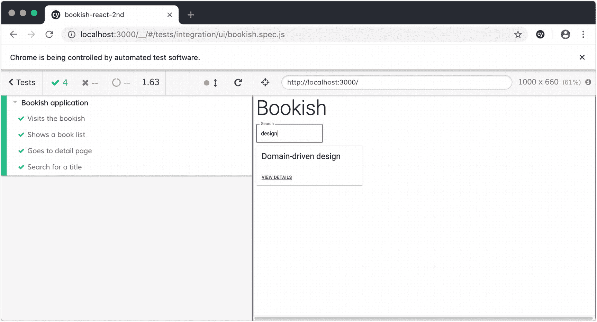
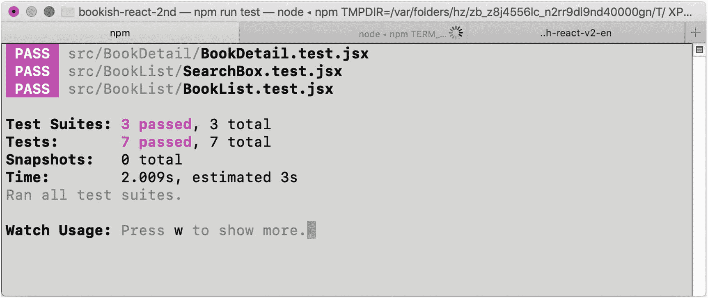

# 七、按关键字搜索

我们的第三个特性将允许用户通过书名搜索一本书。当图书列表变得很长时，这很有用——当内容超过一个屏幕或页面时，用户可能很难找到他们要找的内容。

## 接收试验

如前所述，我们首先编写一个`acceptance test`:

```jsx
  it('Searches for a title', () => {
    cy.visit('http://localhost:3000/');
    cy.get('div.book-item').should('have.length', 4);
    cy.get('[data-test="search"] input').type('design');
    cy.get('div.book-item').should('have.length', 1);
    cy.get('div.book-item').eq(0).contains('Domain-driven design');
  });

```

这个测试试图在`search`输入框中键入关键字`design`，并期望只有`Domain-driven design`会出现在图书列表中。

实现这个特性最简单的方法是通过添加一个来自`material-ui`的`TextField`来修改`BookListContainer`:

```jsx
  return (<>
    <TextField
      label='Search'
      value={term}
      data-test='search'
      onChange={(e) => setTerm(e.target.value)}
      margin='normal'
      variant='outlined'
    />
    <BookList books={data} loading={loading} error={error}/>
  );

```

我们需要将`state`引入组件——在 return 语句之前，添加下面一行，记住从`react`导入`useState`:

```jsx
const [term, setTerm] = useState('');

```

当`term`(搜索词)改变时，我们想要触发新的搜索。我们可以利用`useEffect`钩子，就像

```jsx
  useEffect(() => {
    performSearch(`http://localhost:8080/books?q=${term}`)
  }, [term]);

```

我们可以在这里重新编写每一个`axios.get`、`error`和`loading`步骤，但是更明智的做法是重用我们已经定义的现有的`useRemoteService`。让我们先稍微调整一下:

```jsx
-export const useRemoteService = (url, initialData) => {
+export const useRemoteService = (initialUrl, initialData) => {
   const [data, setData] = useState(initialData);
+  const [url, setUrl] = useState(initialUrl);
   const [loading, setLoading] = useState(false);
   const [error, setError] = useState(false);

@@ -22,7 +23,7 @@

     fetchBooks();
-  }, []);
+  }, [url]);

-  return {data, loading, error};
+  return {data, loading, error, setUrl};
 }

```

通过输出`setUrl`，我们给了外界一个改变`url`的机会。因为我们将`[url]`定义为`fetchBooks`效果的依赖，所以抓取将被触发。

也就是说我们只需要使用`BookListContainer`中的`setUrl`，剩下的工作由钩子来完成(图 [7-1](#Fig1) ):



图 7-1

寻找一本书

```jsx
  const [term, setTerm] = useState('');
  const {data, loading, error, setUrl} = useRemoteService('http://localhost:8080/books', );

  useEffect(() => {
    setUrl(`http://localhost:8080/books?q=${term}`)
  }, [term]);

```

注意，我们使用`books?q=${e.target.value}`作为获取数据的 URL。有`json-server`提供的全文搜索 API 你可以把`books?q=domain`发送到后端，它会返回所有包含该域名的内容。

您可以像这样在命令行上尝试:

```jsx
curl http://localhost:8080/books?q=domain

```

现在，我们的测试又变绿了。让我们跳到`Red-Green-Refactoring`的下一步。

### 更进一步

假设有人想使用我们刚刚在本页完成的搜索框；怎么才能再利用呢？这很难，因为目前搜索框与`BookListContainer`中的其余代码紧密耦合，但是我们可以将其提取到另一个组件中，称为`SearchBox`:

```jsx
import React from 'react';
import TextField from '@material-ui/core/TextField/TextField';

const SearchBox = ({term, onSearch}) => {
  return (<TextField
    label='Search'
    value={term}
    data-test='search'
    onChange={onSearch}
    margin='normal'
    variant='outlined'
  />)
};

export default SearchBox;

```

提取之后，`BookListContainer`变成

```jsx
  const onSearch = (event) => setTerm(event.target.value);

  return (
    <SearchBox term={term} onSearch={onSearch}/>
    <BookList books={data} loading={loading} error={error}/>
  );

```

现在让我们添加一个单元测试:

```jsx
import React from 'react';
import {render} from '@testing-library/react';
import userEvent from '@testing-library/user-event';

import SearchBox from './SearchBox';

describe('SearchBox', () => {
  it('renders input', () => {
    const props = {
      term: '',
      onSearch: jest.fn()
    }

    const {container} = render(<SearchBox {...props} />);
    const input = container.querySelector('input[type="text"]');
    userEvent.type(input, 'domain');

    expect(props.onSearch).toHaveBeenCalled();
  });
})

```

请注意，为了能够使用`user-event`，如果您还没有安装它，您必须安装:

```jsx
yarn add @testing-library/user-event --dev

```

我们使用`jest.fn()`来创建一个`spy`对象，它可以记录调用的轨迹。我们使用`userEvent.type` API 模拟一个`change`事件，以`domain`作为有效负载。然后我们可以期待`onChange`方法已经被调用。

让我们在这里增加一个需求:当执行搜索时，我们不希望`white-space`成为请求的一部分。所以我们在字符串被发送到服务之前对其进行了处理。让我们先写一个测试:

```jsx
  it('trim empty strings', () => {
    const props = {
      term: '',
      onSearch: jest.fn()
    }

    const {container} = render(<SearchBox {...props} />);
    const input = container.querySelector('input[type="text"]');
    userEvent.type(input, '  ');

    expect(props.onSearch).not.toHaveBeenCalled();
  })

```

它会失败，因为我们当前将所有的`values`发送给了`books` API。为了解决这个问题，我们可以在`SearchBox`中定义一个函数，在事件到达上层之前`intercept`:

```jsx
  const protect = (event) => {
    const value = clone(event.target.value);
    if(!isEmpty(value.trim())) {
      return onSearch(event)
    }
  }

```

你会注意到我们使用了一些你以前可能没见过的函数——`clone`和`isEmpty`。这些将需要安装和从洛达什进口。

```jsx
yarn add lodash.isempty lodash.clone

```

不要直接调用`onSearch`而是使用函数`onChange`，如图 [7-2](#Fig2) 所示，所有测试都应该通过:

```jsx
  return (<TextField
    label='Search'
    value={term}
    data-test='search'
    onChange={protect}
    margin='normal'
    variant='outlined'
  />)

```



图 7-2

搜索框的单元测试

### 我们做了什么？

太好了，我们已经完成了所有三个功能！让我们快速回顾一下我们得到的信息:

*   三个纯组件(BookDetail、BookList、SearchBox)及其单元测试

*   两个容器组件(BookDetailContainer、BookListContainer)

*   一个用于数据获取的定制钩子

*   涵盖最有价值路径的四个验收测试(列表、细节和搜索)

## 走向

也许你已经在我们的`end-to-end`测试中注意到了一些代码味道。我们利用了许多新奇的`commands`,但没有准确表达我们在商业价值方面的所作所为:

```jsx
it('Shows a book list', () => {
  cy.visit('http://localhost:3000/');
  cy.get('div[data-test="book-list"]').should('exist');
  cy.get('div.book-item').should((books) => {
    expect(books).to.have.length(3);

    const titles = [...books].map(x => x.querySelector('h2').innerHTML);
    expect(titles).to.deep.equal(['Refactoring', 'Domain-driven design', 'Building Microservices'])
  })
});

```

通过引入一些函数，我们可以显著提高可读性:

```jsx
const gotoApp = () => {
  cy.visit('http://localhost:3000/');
}

const checkAppTitle = () => {
  cy.get('h2[data-test="heading"]').contains('Bookish');
}

```

在测试案例中，我们可以像这样使用它们:

```jsx
  it('Visits the bookish', () => {
    gotoApp();
    checkAppTitle();
  });

```

对于复杂的函数，我们可以抽象得更多:

```jsx
const checkBookListWith = (expectation = []) => {
  cy.get('div[data-test="book-list"]').should('exist');
  cy.get('div.book-item').should((books) => {
    expect(books).to.have.length(expectation.length);

    const titles = [...books].map(x => x.querySelector('h2').innerHTML);
    expect(titles).to.deep.equal(expectation)
  })
}

```

像这样使用它:

```jsx
const checkBookList = () => {
  checkBookListWith(['Refactoring', 'Domain-driven design', 'Building Microservices', 'Acceptance Test Driven Development with React']);
}

```

或者

```jsx
const checkSearchedResult = () => {
  checkBookListWith(['Domain-driven design'])
}

```

在我们提取了几个函数之后，一些模式出现了。我们可以做一些进一步的重构:

```jsx
describe('Bookish application', () => {
  beforeEach(() => {
    feedStubBooks();
    gotoApp();
  });

  afterEach(() => {
    cleanUpStubBooks();
  });

  it('Visits the bookish', () => {
    checkAppTitle();
  });

  it('Shows a book list', () => {
    checkBookListWith(['Refactoring', 'Domain-driven design', 'Building Microservices']);
  });

  it('Goes to the detail page', () => {
    gotoNthBookInTheList(0);
    checkBookDetail();
  });

  it('Search for a title', () => {
    checkBookListWith(['Refactoring',
      'Domain-driven design',
      'Building Microservices',
      'Acceptance Test Driven Development with React']);
    performSearch('design');
    checkBookListWith(['Domain-driven design']);
  });

});

```

这看起来更整洁、更简洁。除了干净之外，我们还分离了业务价值和实现细节，这在将来可能会对我们有所帮助(例如，如果我们想要迁移到另一个测试框架或者重写它的某些部分，那么机构对读者来说是显而易见的)。

## 摘要

在前三章中，我们已经开发了应用`Bookish`的三个特性，并且我们已经了解了如何在实际项目中应用 ATDD。我们已经学习了如何快速设置`react`环境，以及如何使用模拟服务器来启动模拟服务。

我们引入了`Cypress`来写`acceptance tests`。一旦我们有了测试，我们就编写简单的代码使它通过，并在代码中发现代码味道时进行重构。在整个过程中，我们一直使用经典的`Red-Green-Refactor`循环。当我们重构时，我们根据职责和提取方法来拆分代码，重命名类，并重构文件夹，以使代码更加紧凑，更易于阅读和维护。

此外，我们已经为`json-server`添加了一些扩展，使我们能够在运行测试用例之前准备一些数据，并在测试完成后清理。这使得测试本身更具可读性和独立性。

最后，我们学习了如何将`cypress`命令重构为有意义的`functions`来提高可读性。