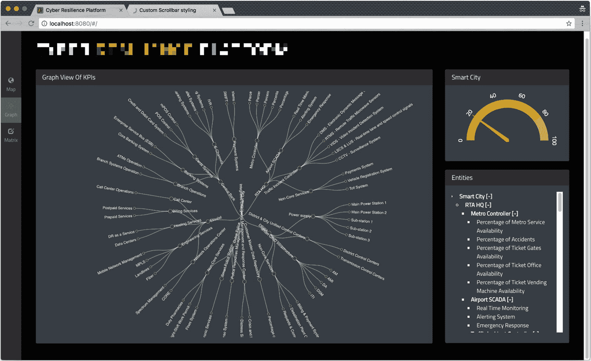
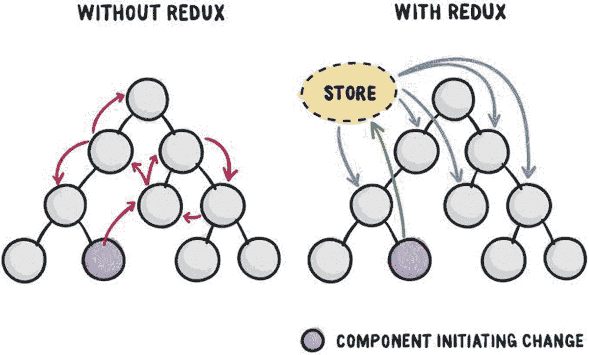
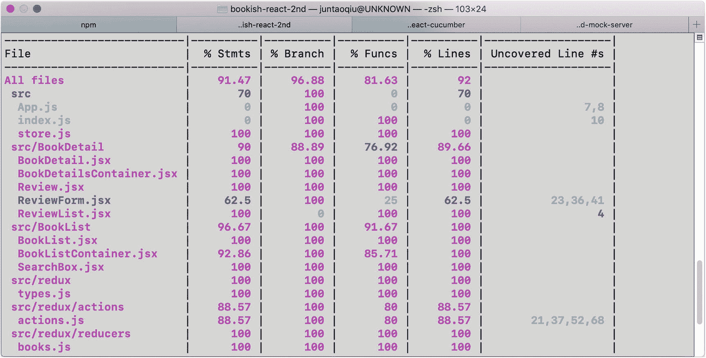

# 八、状态管理

很长一段时间，前端开发都是关于处理不同组件的状态同步。页面上两个搜索框中的关键字(一个在顶部，另一个在底部)、选项卡的活动状态、路由和 URL 中的散列、`show more...`链接等等。所有这些状态管理可能会令人难以置信地困惑。即使发明了像`Backbone`这样的`MVVM`库或双向数据绑定(一种在应用中共享数据的方式，使用它来监听事件并在父组件和子组件之间同时更新值)，如果您必须管理不同组件之间的状态，事情仍然很有挑战性(如果有组件的话——在 jQuery 的世界中，没有真正的`component`,只有 DOM 片段)。

今天，web 开发是一个完全不同的场景。在典型的网页中，交互和数据转换变得更加复杂。处理这些并发症的方式也发生了变化。

## 典型的用户界面场景

让我们来看看图 [8-1](#Fig1) 中这个简单的页面。



图 8-1

许多组件共享相同的数据模型

右边是一个树组件，中间是一个图形组件。现在，当您单击树上的一个节点时，该节点应该根据其以前的状态折叠或展开，并且状态变化也应该同步到图表中。

如果您不想使用任何外部库，只使用来自 DOM API 的自定义事件可能会导致一个`dead-loop`——当您必须在`graph`上注册一个监听器来监听对`tree`的更改时，也要对树做同样的事情。当一个事件被触发时，它将在这两个组件之间来回切换。当你有两个以上的组件时，事情很快会变得更糟。

更可靠的方法是提取底层数据并使用发布-订阅模式:树和图都在监听数据的变化；一旦数据改变，组件应该重新呈现自己。

这种模式的实现现在很普遍；你几乎可以在每个网页上找到它。你可以实现自己的发布订阅库；然而，您可能会发现它很乏味，很难维护。幸运的是，我们有选择。

每当底层数据发生变化——无论是浏览器上的用户事件、计时器还是异步服务调用——我们都需要一种简单的方法来管理这些变化，并确保数据模型总是反映在所有组件的最新数据中。

## Redux 简介

`Redux`是一个流行的 JavaScript 状态管理工具。

正如`redux`文档所述:

Redux 是 JavaScript 应用的可预测状态容器。

通过使用它，测试和调试您的应用变得简单明了，并且您可以轻松地跟踪它的状态。它没有绑定到任何库或框架，所以虽然您不必将它与`React`一起使用，但这是它最常见的实现。

### 冗余的三个原则

*   真理的单一来源

*   状态为只读

*   变化是由纯函数产生的

在`Redux`世界中，所有状态都存储在一个全局数据源中。在任何时候，这个数据源都可以映射到视图。当发生变化时——例如，用户点击一个按钮，发生超时，或者后端异步消息到达——将创建一个`action`,以描述发生了什么的对象的形式。

只是 JavaScript 对象形式的信息负载，将信息从我们的应用传输到我们的状态存储中。

一旦被创建，`action`将通过一个名为`reducer`的纯函数。`reducer`将指定应用状态如何响应动作而改变，这可能会触发视图的另一次重新呈现。它接受先前的状态和`action`并返回新的状态。图 [8-2](#Fig2) 清晰地展示了这一过程。



图 8-2

使用或不使用 redux 的应用。来源:Danny Huang([https://kuanhsuh。github。io/2017/09/28/What-s-Redux-and-how-to-use-it/](https://kuanhsuh.github.io/2017/09/28/What-s-Redux-and-how-to-use-it/)

由于`React`提供的`virtual dom`机制，UI 会以最小的努力重新渲染。

## 解耦数据和视图

如果你仔细看看我们的`useRemoteService`钩子，你会注意到它实际上做了很多事情:

1.  它向外部服务发出数据请求。

2.  它负责 url 的更改。

3.  它管理几种状态，包括`loading`和`error`。

```jsx
export const useRemoteService = (initialUrl, initialData) => {
  const [data, setData] = useState(initialData);
  const [url, setUrl] = useState(initialUrl);
  const [loading, setLoading] = useState(false);
  const [error, setError] = useState(false);

  useEffect(() => {
    const fetchBooks = async () => {
      setError(false);
      setLoading(true);

      try {
        const res = await axios.get(url);
        setData(res.data);
      } catch (e) {
        setError(true);
      } finally {
        setLoading(false);
      }
    };

    fetchBooks();
  }, [url]);

  return {data, loading, error, setUrl};
}

```

其中一些状态将总是一起更新，例如:

```jsx
{
  data: [],
  loading: false,
  error: false
}

```

或者

```jsx
{
  error: true
}

```

然而，在前面讨论的代码片段中，乍一看并不明显。

理想情况下，我们可以重写容器对象来触发一些数据获取动作，如`BookDetailContainer`中所示:

```jsx
const BookDetailContainer = ({match}) => {
  const book = fetchBookById(match.params.id);
  // that will fetch data with `match.params.id`
  return (<BookDetail book={book}/>);
};

```

`fetchBookById`可以是同步函数调用，也可以是同步远程调用，但对于`BookDetailContainer`来说，关系不大。如前所述，在全局空间中，除了所有组件之外，还有一个维护应用状态的存储(类似于数据库)。每当在 UI 中的某个地方触发一个动作，并且发生一些修改时，相应的更新数据就会被发送到需要重新呈现的组件。

这就是状态管理容器可以帮助我们的方式。容器可以为我们处理细节，包括监听变化、分派动作、减少状态和广播变化。

## 视图= f(状态)

在`React`社区中有一个众所周知的公式(有趣的是，这种模式似乎很久以前就已经在桌面 GUI 环境中讨论过了，更多内容请阅读底部的“`Further Reading`”部分):`view = f(state)`，这意味着`view`只是`state`的一个函数。`state`这里展示了我们的应用状态的快照。例如，当用户打开`Bookish`主页时，该时间点的数据快照可能是

```jsx
const state = {
    books: [
      {'name': 'Refactoring', 'id': 1, 'description': 'Refactoring'},
      {'name': 'Domain-driven design', 'id': 2, 'description': 'Domain-driven design'},
      {'name': 'Building Microservices', 'id': 3, 'description': 'Building Microservices'}
    ],
    term: ''
}

```

当用户在搜索框中键入`Domain`时，快照变成

```jsx
const state = {
    books: [
      {'name': 'Domain-driven design', 'id': 2, 'description': 'Domain-driven design'}
    ],
    term: 'Domain'
}

```

这两段数据(状态)可以在某一点上代表整个应用。由于`view = f(state)`，对于任何给定的`state`，`view`总是可预测的，所以应用开发人员唯一关心的是如何操作数据，因为`UI`将自动呈现。

我知道这听起来很简单，但它只是最近才出现在现实世界的应用中(第一次发布`redux`是在 2015 年 6 月，仅仅五年前)。

## 实施状态管理

为了使用 redux 处理应用的状态管理，我们需要处理所有三个组件:动作、reducer 和全局存储。让我们首先通过安装一些依赖项来设置环境。

### 环境设置

首先，我们需要添加一些包来使我们能够使用`redux`:

```jsx
npm install redux redux-thunk history react-router-redux reselect --save

```

### 从`Action`开始

在`redux`中，动作是将数据从应用发送到商店的有效信息负载。它类似于其他 GUI 应用中的事件。要将此信息应用到商店，您必须`dispatch`(发送)它。

`action`是一个很好的切入点——它将促使我们考虑组件之间的交互方式，以及每个组件如何与外界交互。

以`BookListContainer`为例。我们期望它有能力设置搜索的关键字。

创建一个名为`redux`的文件夹，在名为`actions`的子文件夹中，添加一个名为`actions.test.js`的文件:

```jsx
import { setSearchTerm } from './actions'

describe('BookListContainer related actions', () => {
  it('Sets the search keyword', () => {
    const term = ''
    const expected = {
      type: 'SET_SEARCH_TERM',
      term
    }
    const action = setSearchTerm(term)
    expect(action).toEqual(expected)
  })
})

```

这个测试断言，当一个搜索词被提供给`setSearchTerm`动作创建者时，该动作将被创建。

顾名思义，动作创建者将创建一个动作，并且通常将与来自用户交互(鼠标点击、键盘)的事件绑定。

所以目前，`setSearchTerm`只是`actions.js`中的一个空函数，但是在这里实现非常简单:

```jsx
export const setSearchTerm = (term) => {
  return { type: 'SET_SEARCH_TERM', term }
}

```

动作有一个`type`属性，表示正在执行的动作的类型，但是除此之外，动作对象的结构由我们来定义。

`setSearchTerm`接受一个搜索词，并返回一个类型为`SET_SEARCH_TERM`的动作，以及作为搜索词提供的任何字符串。

小菜一碟！

请注意，虽然我们在这里的商店中保存了 term，但我们不必这样做。这实际上是由您——开发人员——来决定将这些状态放在哪里。一个很好的经验法则是让`store`尽可能的简单和平坦。任何可以由其他字段计算的数据都不应该放在那里，而且在大多数情况下，其他人不关心的内部状态也应该放在组件内部。

#### 异步操作

对于异步操作来说，事情变得有点棘手。为了让这些工作，我们需要配置`redux-thunk`并创建一个模拟`store`(用于测试)。

`Redux-thunk`是一个中间件(基本上，一个中间件可以拦截你发送的所有动作，并基于某种条件来存储和操作它们，例如，做一些审计或日志记录)，它允许动作创建者返回一个函数而不是一个动作。这意味着我们可以延迟调度动作，或者只基于条件逻辑进行调度，从而允许我们处理异步动作。

让我们先将`redux-mock-store`添加到依赖项中:

```jsx
npm install redux-mock-store --save-dev

```

在我们编写测试之前，我们将在`actions.test.js`中创建一个`mockStore`，如下所示:

```jsx
import configureMockStore from 'redux-mock-store'
import thunk from 'redux-thunk'

const middlewares = [thunk]
const mockStore = configureMockStore(middlewares)

```

然后，让我们定义一条快乐的路径，假设网络正在运行，我们可以检索正在获取的数据(记住还要导入`axios`,因为我们将它用于网络请求):

```jsx
it('Fetches data successfully', () => {
  const books = [
    { id: 1, name: 'Refactoring' },
    { id: 2, name: 'Domain-driven design' },
  ];
  axios.get = jest
    .fn()
    .mockImplementation(() => Promise.resolve({ data: books }));

  const expectedActions = [
    { type: 'FETCH_BOOKS_PENDING' },
    { type: 'FETCH_BOOKS_SUCCESS', books },
  ];
  const store = mockStore({ books: [] });

  return store.dispatch(fetchBooks('')).then(() => {
    expect(store.getActions()).toEqual(expectedActions);
  });
});

```

这里，我们期望`fetchBooks`将创建两个`actions`:一个表示请求已经发送，另一个表示响应已经收到。

因为请求在底层使用了`axios`，我们可以使用`jest.fn().mockImplementation()`来存根它。它将拦截对`axios.get`的调用，并调用我们定义的任何函数，所以我们不会在测试中发送真正的 HTTP 请求。

```jsx
axios.get = jest.fn().mockImplementation(
  () => Promise.resolve({data: books}))

```

下面是`actions.js`里面的实现:

```jsx
import axios from 'axios'

export const fetchBooks = () => {
  return (dispatch) => {
    dispatch({type: 'FETCH_BOOKS_PENDING'})
    return axios.get(`http://localhost:8080/books`).then((res) => {
      dispatch({type: 'FETCH_BOOKS_SUCCESS', books: res.data})
    })
  }
}

```

首先，我们`dispatch`一个`FETCH_BOOKS_PENDING`动作并调用`axios.get`。当承诺被解析时，我们可以用响应作为有效负载来`dispatch`T4 动作。

#### 失败场景

对于网络故障的情况(例如，超时)，我们可以在单元测试中再次使用`jest.fn().mockImplementation()`:

```jsx
axios.get = jest.fn().mockImplementation(
  () => Promise.reject({message: 'Something went wrong'}))

```

然后，验证失败的操作是否按预期调度:

```jsx
it('Fetch data with error', () => {
  axios.get = jest
    .fn()
    .mockImplementation(() =>
       Promise.reject({ message: 'Something went wrong' })
    );

  const expectedActions = [
    { type: 'FETCH_BOOKS_PENDING' },
    { type: 'FETCH_BOOKS_FAILED', err: 'Something went wrong' },
  ];
  const store = mockStore({ books: [] });

  return store.dispatch(fetchBooks('')).then(() => {
    expect(store.getActions()).toEqual(expectedActions);
  });
});

```

我们可以在 promise `rejected`分支中添加一个`catch`案例来使我们的测试绿色化:

```jsx
export const fetchBooks = (term) => {
  return (dispatch) => {
    dispatch({type: 'FETCH_BOOKS_PENDING'})
    return axios.get(`http://localhost:8080/books?q=${term}`).then((res) => {
      dispatch({type: 'FETCH_BOOKS_SUCCESS', books: res.data})
    }).catch((err) => {
      dispatch({type: 'FETCH_BOOKS_FAILED', err: err.message})
    })
  }
}

```

#### 搜索动作

我们期望动作`fetchBooks`可以在发送请求时使用来自`store`的`term`值作为关键字，这将启用过滤器功能。

请注意，我们正在将`mockStore`中的`term`设置为`domain`，并且需要更新 fetchBooks 操作以考虑所提供的查询参数:

```jsx
it('Search data with term', () => {
  const books = [
    { id: 1, name: 'Refactoring' },
    { id: 2, name: 'Domain-driven design' },
  ];
  axios.get = jest
    .fn()
    .mockImplementation(() => Promise.resolve({ data: books }));

  const store = mockStore({ books: [] });

  return store.dispatch(fetchBooks('domain')).then(() => {
    expect(axios.get).toHaveBeenCalledWith(
      'http://localhost:8080/books?q=domain'
    );
  });
});

```

#### 重构

在`action`测试和实现中有很多硬编码和“神奇”的字符串。我们可以将它们提取到某个公共位置，这样就可以从那里引用它们。让我们创建一个名为`types.js`的文件:

```jsx
export const SET_SEARCH_TERM = 'SET_SEARCH_TERM'
export const FETCH_BOOKS_PENDING = 'FETCH_BOOKS_PENDING'
export const FETCH_BOOKS_SUCCESS = 'FETCH_BOOKS_SUCCESS'
export const FETCH_BOOKS_FAILED = 'FETCH_BOOKS_FAILED'

```

并将它作为变量`types`导入到我们想要使用它的地方:

```jsx
import * as types from './types'

```

然后，我们可以用`types.FETCH_BOOKS_PENDING`来引用它:

```jsx
const expectedActions = [
  { type: types.FETCH_BOOKS_PENDING},
  { type: types.FETCH_BOOKS_SUCCESS, books }
]

```

## 还原剂

在`redux`中，`reducer`只是一个纯函数——如果输入是确定的，那么输出总是可预测的。`reducer`负责阐明应用的状态将如何改变，以响应发送到商店的任何动作。

实现缩减器非常简单。比如`FETCH_BOOKS_PENDING`和`FETCH_BOOK_SUCCESS`可以这样测试，在`reducers/reducer.test.js`里面:

```jsx
import reducer from './reducer';
import * as types from '../types';

describe('Reducer', () => {
  it('Show loading when request is sent', () => {
    const initState = { loading: false };

    const action = { type: types.FETCH_BOOKS_PENDING };
    const state = reducer(initState, action);

    expect(state.loading).toBeTruthy();
  });

  it('Add books to state when request successful', () => {
    const books = [
      { id: 1, name: 'Refactoring' },
      { id: 2, name: 'Domain-driven design' },
    ];

    const action = {
      type: types.FETCH_BOOKS_SUCCESS,
      books
    };

    const state = reducer([], action);
    expect(state.books).toBe(books);
  });
});

```

我们期望当`FETCH_BOOKS_PENDING`动作被发送到 reducer 时，它会将`loading`设置为`true`，并且`FETCH_BOOKS_SUCCESS`会附加响应(图书列表)来声明请求何时成功。

```jsx
import * as types from '../types';

const reducer = (state = [], action) => {
  switch (action.type) {
    case types.FETCH_BOOKS_PENDING:
      return { ...state, loading: true };
    case types.FETCH_BOOKS_SUCCESS:
      return { books: action.books };
    default:
      return state;
  }
};

export default reducer;

```

测试 action creator 就像 Java 中的[值-对象](https://martinfowler.com/bliki/ValueObject.html)测试一样，测试`reducer`相当于测试静态`util`类。在`React`社区，人们倾向于将`action+reducer+store`作为集成测试一起测试。就我个人而言，我根本不直接测试那些代码。他们甚至在我的`package.json`的`modulePathIgnorePatterns`部分被明确忽略。

我们将在下一节详细讨论这一点。

## Redux 的集成测试`Store`

在 src 文件夹中，创建`store.test.js`:

```jsx
import axios from 'axios';

import * as actions from './redux/actions/actions';
import store from './store';

describe('Store', () => {
  const books = [
    {id: 1, name: 'Refactoring'}
  ]

  it('Fetch books from remote', () => {
    axios.get = jest.fn().mockImplementation(() => Promise.resolve({data: books}))

    return store.dispatch(actions.fetchBooks()).then(() => {
      const state = store.getState()
      expect(state.books.length).toEqual(1)
      expect(state.books).toEqual(books)
    })
  })
})

```

然后，我们创建`store.js`。我们导入前面定义的`actions`，创建一个真正的`store`来执行`dispatch`，并期望它返回`correct`响应。我们导入真实的`reducers`，并使用`redux`提供的`createStore`函数创建一个商店:

```jsx
import { applyMiddleware, createStore, compose } from 'redux';
import thunk from 'redux-thunk';

import reducer from './redux/reducers/reducer';

const initialState = {};

const middlewares = [thunk]

const composedEnhancers = compose(
  applyMiddleware(...middlewares)
)

const store = createStore(
  reducer,
  initialState,
  composedEnhancers
)

export default store

```

这是我们的集成测试——它将`action + reducer + store`连接在一起。这种测试比其他单元测试稍微重一点，但是它提供了独特的价值:它证明了每个元素可以一起工作来提供预期的结果。

既然我们已经将动作和 reducers 连接到了状态，那么让我们更新我们的`fetchBooks`动作来使用状态。

```jsx
-export const fetchBooks = (term) => {
+export const fetchBooks = () => {
- return (dispatch) => {
+ return (dispatch, getState) => {
    dispatch({ type: types.FETCH_BOOKS_PENDING });
+   const state = getState();
-   return axios.get(`http://localhost:8080/books?q=${term || ''}`).then((res) => {
+   return axios.get(`http://localhost:8080/books?q=${state.term || ''}`).then((res) => {
      dispatch({ type: types.FETCH_BOOKS_SUCCESS, books: res.data });
    }).catch((err) => {
        dispatch({type: types.FETCH_BOOKS_FAILED, err: err.message})
      });
  };
};

```

您还需要在`Search data with term`测试中更新 mockStore。

现在，我们可以为我们的`searching`功能添加另一个集成测试:

```jsx
it('Performs a search', () => {
  axios.get = jest.fn().mockImplementation(() => Promise.resolve({data: books}))
  store.dispatch(actions.setSearchTerm('domain'))

  return store.dispatch(actions.fetchBooks()).then(() => {
    const state = store.getState()

    expect(state.term).toEqual('domain')
    expect(axios.get).toHaveBeenCalledWith('http://localhost:8080/books?q=domain')
  })
})

```

## 迁移应用

我们的下一步是将我们的应用迁移到`redux`。由于我们有足够的验收测试，我们不需要担心破坏任何功能。

首先，我们需要添加`react-redux`作为依赖项:

```jsx
npm install react-redux

```

我们将`store`传递给`index.js`中的`Provider`组件。这意味着整个组件树可以在任何时候共享这个`store`:

```jsx
+import { Provider } from 'react-redux';
+import store from './store';

-ReactDOM.render(<Router>
-  <App />
-</Router>, document.getElementById('root'));
+const root = <Provider store={store}>
+  <Router>
+    <App />
+  </Router>
+</Provider>
+
+ReactDOM.render(root, document.getElementById('root'));

```

由于`presentational`组件是无状态的，我们让它们保持原样——我们的迁移应该只影响`container`组件。对于`BookListContainer`，将会有很多变化，因为数据获取被委托给`actions`:

```jsx
const dispatch = useDispatch();

useEffect(() => {
  dispatch(actions.fetchBooks(term))
}, [term]);

```

`useDispatch`随`react-redux`一起提供，可用于分派我们之前定义的动作—`fetchBooks`。

每当`BookListContainer`中的`term`状态发生变化，就会触发`fetchBooks`，一旦服务器端返回数据，我们就可以用一个`selector`从状态中导出我们需要的数据。因为我们想让我们的商店尽可能精简，符合良好 redux 架构的原则，所以我们使用了`selector`。`selector`函数接受 Redux 存储状态作为参数，并根据该状态返回数据。

我们可以选择用来自`redux`的`useSelector`来做这件事，就像

```jsx
const books = useSelector(state => state.books);

```

或者定义一个函数来完成所有的映射。我更喜欢第二种选择，使用一个名为`reselect`的库，因为它提供了一个可组合的选择器和可缓存的结果(这意味着它将在内部保存计算出的值，除非值的依赖关系已经改变)，以记忆的形式。这样，我们的应用可以更有性能，特别是对于具有相对较大存储空间的应用。让我们先将它安装到项目中:

```jsx
npm install reselect

```

然后，我们在`redux/selector`中定义一个`selector`:

```jsx
import { createSelector } from 'reselect';

const bookListSelector = createSelector([
  state => state.books,
  state => state.loading,
  state => state.error,
], (books, loading, error) => ({books, loading, error}));

export default bookListSelector;

```

`createSelector`接受两个参数，一个输入选择器数组和一个转换函数，并返回一个记忆的选择器。并不是说我们的 transform 函数现在不做太多的转换，只是直接从 state 返回值。

最后，将它们连接起来:

```jsx
import bookListSelector from '../../redux/selectors/selector';

const BookListContainer = () => {
  const [term, setTerm] = useState();
  const dispatch = useDispatch();

  useEffect(() => {
    dispatch(actions.fetchBooks());
  }, [term, dispatch]);

  const onSearch = (event) => {
    dispatch(actions.setSearchTerm(event.target.value));
    dispatch(actions.fetchBooks());
  };

  const { books, loading, error } = useSelector(bookListSelector);

  return (

      <SearchBox term={term} onSearch={onSearch} />
      <BookList books={books} loading={loading} error={error} />

  );
};

```

### 测试容器

如果你仔细看看`BookListContainer`，你会发现在单元测试级别测试是相对困难的。这么说，我的意思是它依赖于一些外部组件，如`actions`甚至网络。

我们不想使用真实的网络，所以我们需要想出一种方法来模拟网络。幸运的是，`axios-mock-adapter`可以为我们做到这一点。

```jsx
npm install axios-mock-adapter --save-dev

```

在`BookListContainer` `.test`中，导入新的依赖项并创建一个新的 mock。我们可以通过调用`onGet`并在`reply`中提供预期的结果来定义模拟。在我们的例子中，我们需要从下游返回的两本书:

```jsx
  it('renders', async () => {
    const mock = new MockAdapter(axios);
    mock.onGet('http://localhost:8080/books?q=').reply(200, [
      {'name': 'Refactoring', 'id': 1},
      {'name': 'Acceptance tests driven development with React', 'id': 2},
    ]);

    const {findByText} = renderWithProvider(<BookListContainer/>);

    const book1 = await findByText('Refactoring');
    const book2 = await findByText('Acceptance tests driven development with React');

    expect(book1).toBeInTheDocument();
    expect(book2).toBeInTheDocument();
  });

```

注意，我们使用了另一个包装函数——`renderWithProvider`——来避免在`provider`之外调用`useDispatch`所导致的错误。本质上，`react-redux`期望钩子在`<Provider>`内部被调用。

```jsx
const renderWithProvider = (component) => {
  return {...render(<Provider store={store}>
      <Router>
        {component}
      </Router>
    </Provider>)}
};

```

在这里，我们使用与实际应用中相同的存储。当然，您也可以为测试定义一些静态存储。

此外，我们使用来自`@testing-library/jest-dom`的`toBeInTheDocument`断言:

```jsx
npm install @testing-library/jest-dom --save-dev

```

由于我们已经在`cypress`测试中介绍了这个功能，您可能想知道在这里测试这个功能有什么意义。这是因为我们可以用更快的反馈测试更多的案例。例如，如果我们想确保当网络故障发生时，我们应该在页面上看到一条`error`消息。由于网络故障的原因多种多样，在慢速`cypress`测试中测试每一种可能性并不理想。

相反，一个简单的`integration test`将为我们工作:

```jsx
it('something went wrong', async () => {
  const mock = new MockAdapter(axios);
  mock.onGet('http://localhost:8080/books?q=').networkError();

  const {findByText} = renderWithProvider(<BookListContainer/>);
                                          const error = await findByText('Error...');

  expect(error).toBeInTheDocument();
})

```

通过使用`axios-mock-adapter`，您可以很容易地模拟不同的网络问题，甚至是数据形状改变的情况以及组件将如何处理它。

我们还需要向我们的 reducer 添加一个案例，以确保将错误状态添加到状态中。

```jsx
case types.FETCH_BOOKS_FAILED:
return { ...state, loading: false, error: true };

```

### 获取图书详细信息

为了完成我们的迁移，我们需要为我们的`BookDetailContainer`创建一个`action`，而我们只需要一本书:

```jsx
it('Fetch book by id', () => {
  const book = {id: 1, name: 'Refactoring'}
  axios.get = jest.fn().mockImplementation(() => Promise.resolve({data: book}))

  const store = mockStore({list: { books: [], term: '' }})

  return store.dispatch(fetchABook(1)).then(() => {
    expect(axios.get).toHaveBeenCalledWith('http://localhost:8080/books/1')
  })
})

```

我们可以复制`fetchBooks`，稍加修改就可以创造出`fetchABook`。它需要一个`id`参数来发送请求:

```jsx
export const fetchABook = (id) => {
  return (dispatch) => {
    dispatch({type: types.FETCH_BOOK_PENDING})
    return axios.get(`http://localhost:8080/books/${id}`).then((res) => {
      dispatch({type: types.FETCH_BOOK_SUCCESS, book: res.data})
    }).catch((err) => {
      dispatch({type: types.FETCH_BOOK_FAILED, err: err.message})
    })
  }
}

```

`store`中的集成测试类似:

```jsx
it('Fetch a book from remote', () => {
  axios.get = jest.fn().mockImplementation(() => Promise.resolve({data: books[0]}))

  return store.dispatch(actions.fetchABook(1)).then(() => {
    const state = store.getState()
    expect(state.book).toEqual(books[0])
  })
})

```

和`BookDetailContainer`可以简化为

```jsx
const BookDetailContainer = ({match}) => {
  const dispatch = useDispatch();

  useEffect(() => {
    dispatch(actions.fetchABook(match.params.id))
  }, []);

  const book = useSelector(state => state.detail);

  return (<BookDetail book={book}/>);
};

export default BookDetailContainer

```

由于这部分代码是由`redux`验证的，我们就不用测试了。我们的工作是确保`BookDetailContainer`正常工作:

```jsx
describe('BookDetailContainer', () => {
  it('renders', async () => {
    const props = {
      match: {
        params: {
          id: 2
        }
      }
    };
    const mock = new MockAdapter(axios);
    mock.onGet('http://localhost:8080/books/2').reply(200, {
      'name': 'Acceptance tests driven development with React', 'id': 2
    });

    const {findByText} = renderWithProvider(<BookDetailContainer {...props} />);

    const book = await findByText('Acceptance tests driven development with React');
    expect(book).toBeInTheDocument();
  })
});

```

我们现在已经成功迁移到`redux`，测试覆盖看起来如图 [8-3](#Fig3) 。



图 8-3

测试覆盖报告

让我们看看我们在这里做了什么:

*   动作、减速器的单元测试。

*   `action + reducer + store`的集成测试。

*   验收测试保持绿色。

这真是一个伟大的成就。

## 摘要

在本章中，我们引入了`redux`作为状态管理机制。通过对`action`和`reducer,`进行单元测试，我们已经为我们的应用推出了必要的`redux`组件。经过一些重构，我们已经将我们的`container`代码迁移到了`redux`。

在移植之后，我们发现我们的`container`易于测试，所以我们**为它添加了**一些单元测试。

这个`test-last`看起来有点奇怪，特别是在强调了首先编写我们的单元测试的重要性之后，但是如果你把它当作`refactoring,`的一部分，那就没问题了。当处理遗留代码时，我们总是会面临类似的问题。有时候，代码太难测试了；为了编写测试，您可能需要进行许多更改。在这种情况下，我们可以编写一个高级(验收)测试来确保业务需求总是得到满足。之后，我们可以`refactor`拆分当前的实现，然后我们添加适当的单元测试。

这些单元测试不仅验证功能，还作为文档，使其他团队成员通过查看组件的测试来理解如何使用组件成为可能。

## 进一步阅读

虽然为您的应用设计商店的形状具有挑战性，但您可能希望在这里获得一些关于如何以一种易于扩展和操作的方式来塑造它的见解: [`https://medium.com/javascript-scene/10-tips-for-better-redux-architecture-69250425af44`](https://medium.com/javascript-scene/10-tips-for-better-redux-architecture-69250425af44) 。

在他关于 GUI 架构的文章中，Martin Fowler 描述了观察者同步模式，这很像我们在网络世界中所做的: [`https://martinfowler.com/eaaDev/uiArchs.html`](https://martinfowler.com/eaaDev/uiArchs.html) 。