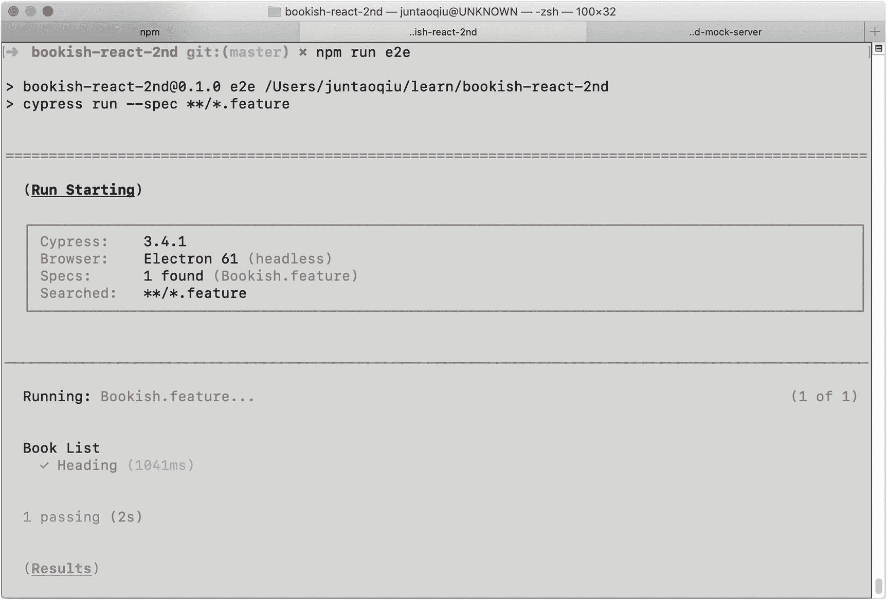
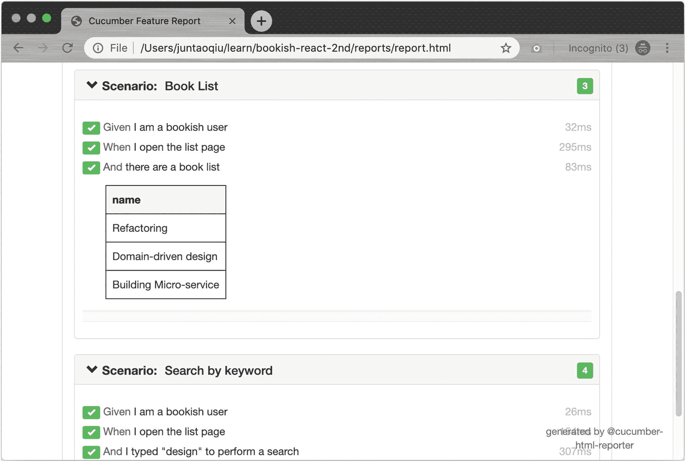

# 十、行为驱动开发

行为驱动开发(BDD)是由 Dan North 创建的。他的目标是改善业务和技术团队之间的交流，以帮助创建具有商业价值的软件。业务和技术团队之间的沟通不畅通常是软件项目交付的最大瓶颈，开发人员通常会误解业务目标，业务团队无法掌握技术团队的能力。BDD 是一个通过改善工程师和商业专家之间的交流来帮助管理和交付软件开发项目的过程。在这样做的时候，BDD 确保所有的开发项目都集中在交付业务实际需要的东西上，同时满足用户的所有需求。

—康斯坦丁·库德良绍夫，阿利斯泰尔·施泰德，丹·诺斯来自博文《BDD 入门指南》

这个概念是从已建立的敏捷实践中发展而来的，并且有不同的实践用于实现 BDD，但是它的核心是用人类可读的语言编写我们的自动化测试，以一种业务和开发团队都可以很容易理解的方式。这鼓励了跨角色的协作，以创建对他们试图解决的问题的共同理解，并产生系统文档，该文档根据实际的系统行为被自动测试。

你可能听说过在进行 BDD 时使用的一些实践，包括*举例说明*和*现场文档*。这些实践提供了特定的技术，可以改善团队中不同角色之间的协作。它们可以帮助开发人员理解业务目标，并帮助他们针对业务限制做出更好的决策。当由于业务需求的更新而实施变更时，可以确保软件的行为符合预期。它旨在防止出现所有测试都通过，但系统行为不正确的情况。

当你试图在你的团队中采用`BDD`作为实践时，有很多工具可用。我们在这里要演示的是`cucumber`，这是一个强大的工具，它使用一种`DSL`(特定领域语言)让开发人员首先编写一个人类可读的文档，并产生可执行代码作为副作用(通过一些纯魔法，我们将很快解决)。

它可以用作业务分析师和用代码编写业务规则的开发人员之间的交流工具。正如我们所知，大多数错误来自沟通失误，因此拥有一个专门的工具来处理这个过程将非常有帮助。在某些情况下，`cucumber`写的`Live Document`是不可执行的，或者太昂贵而不能定期运行。它仍然是一个有效的工具，可以在`QA`过程中提供帮助，作为进行手工测试的指南。

理论够了，开始吧。

## 玩黄瓜

好消息是`cypress`有一个极好的`cucumber`插件；这意味着我们可以一起使用它们。

### 安装并配置`Cucumber`插件

只需要几个步骤就可以配置并让它们正常工作:

```jsx
npm install --save-dev cypress-cucumber-preprocessor

```

在文件`cypress/plugins/index.js`中，我们需要启用`cucumber`:

```jsx
const cucumber = require('cypress-cucumber-preprocessor').default

module.exports = (on, config) => {
  on('file:preprocessor', cucumber())
}

```

在项目根文件夹的`cypress.json`文件中，添加这一行，让`cypress`加载以 feature 结尾的文件(通过使用 wildcast *。特征)文件改为:

```jsx
{
  "testFiles": "**/*.feature"
}

```

最后一步是在`package.json`中添加一个用于定制`plugin`的新部分(我们稍后会添加更多):

```jsx
"cypress-cucumber-preprocessor": {
  "nonGlobalStepDefinitions": true
}

```

酷，配置就这么多了。我们现在可以开始用简单的英语编写一些测试。

## 带`cucumber`的 Live 文档

### 文件结构

默认情况下，`cypress-cucumber-preprocessor`在`cypress/integration`文件夹下寻找`feature`文件:

```jsx
cypress/integration
├── Bookish
│   ├── heading.js
│   ├── index.js
├── Bookish.feature

```

所以在运行时，`cypress-cucumber-preprocessor`会加载`*.feature`并尝试执行它们。

### 第一个特性规范

因为您可以用简单的英语描述您的测试，所以将我们在第 [3](03.html) 章中描述的验收标准转换成`cucumber`想要的格式应该很简单:

```jsx
Feature: Book List
  As a reader
  I want to see books that are trending
  So I know what to read next

  Scenario: Heading
    Given I am a bookish user
    When I open the list page
    Then I can see the title "Bookish" is listed

```

注意缩进和关键字，如`Scenario`、`Given`、`When`和`Then`。早期的一些文字只是针对人类的。例如，翻译对`As a <role>, I want to <do something>, So that<business value>`部分不感兴趣。那部分就像任何其他编程语言中的注释一样，不会被`cucumber`拾取。相反，它将从下面的`Scenario`部分开始。

### 定义步骤

一个`Scenario`部分中的所有句子被称为一个`step`定义，需要在幕后以某种方式翻译成可执行代码。`cucumber`使用正则表达式匹配句子。它试图从句子中提取一些参数，然后传递给`step`函数。

#### 通过逐步定义来解释句子

我们可以用来自`cypress-cucumber-preprocessor`的`Given`、`When`和`Then`函数定义正则表达式，并在这些函数中做一些有趣的事情。

例如:

```jsx
import {checkAppTitle, gotoApp} from '../../helpers';

import {Given, Then, When} from 'cypress-cucumber-preprocessor/steps';

Given(`I am a bookish user`, () => {
  //
});

When(`I open the list page`, () => {
  gotoApp();
});

Then(`I can see the title {string} is showing`, (title) => {
  checkAppTitle(title);
});

```

传递给`Given`、`When`和`Then`函数的`parameters`非常相似；第一个是正则表达式，用于匹配`.feature`文件中的一个句子。第二个是类似的正则表达式，它返回一个回调，一旦有匹配就调用这个回调。如果正则表达式中有一些模式，值将被提取并传递给回调函数(参见`Then`示例)。这是一个简单但强大的机制，允许我们做一些有趣的工作——包括启动浏览器和检查特定元素是否显示在页面上。

现在让我们运行`npm run e2e`(正如你在下面的图 [10-1](#Fig1) 中看到的)来验证所有东西都被正确链接了。



图 10-1

运行特征文件中定义的测试

所以，我们的`Feature`被正确解释，参数被提取并相应地传递给方法。注意，我们可以重用在前面章节中提取的函数，比如`gotoApp()`和`checkAppTitle`。

### 书单

连接好每一部分后，我们现在可以开始用现有的`helper`函数定义一个步骤。

#### 定义图书列表`Scenario`

```jsx
  Scenario: Book List
    Given I am a bookish user
    When I open the list page
    And there is a book list
      | name                   |
      | Refactoring            |
      | Domain-driven design   |
      | Building Microservices |

```

如果您使用过`markdown`来编写文档，您将会认识到我们刚刚在前面定义的`table`。没错，你可以使用`table`在`feature`文件中定义更复杂的数据结构:管道`|`包围的结构。这是在测试中组织可重复数据的一种更好的方式，既便于人类阅读，也便于代码解析。

#### 使用数据表接口

每行将被视为表中的一行，实际上您可以为每行定义许多列:

```jsx
    And there is
      | name                   | price |
      | Refactoring            | $100  |
      | Domain-driven design   | $120  |
      | Building Microservices | $80   |

```

`cucumber`提供了一个引人注目的`DTI`(数据表接口)来帮助开发者解析和使用数据表。例如，如果我们想在`step`内获取`feature`文件中定义的书目，只需使用`table.rows`:

```jsx
And(`there are a book list`, table => {
  console.log(table.rows())
});

```

您将在控制台中以此形状显示数据:

```jsx
[ [ 'Refactoring' ],
  [ 'Domain-driven design' ],
  [ 'Building Microservices' ] ]

```

或者，如果您更喜欢 JSON，您可以调用`table.hashes()`来代替:

```jsx
[ { name: 'Refactoring' },
  { name: 'Domain-driven design' },
  { name: 'Building Microservices' } ]

```

因此，在我们的步骤定义中，我们可以使用`DTI`来做断言:

```jsx
And(`there is a book list`, table => {
  const actual = table.rows().map(x => x[0]);
  checkBookListWith(actual);
});

```

#### `Before`和`After`挂钩

正如我们在`raw` cypress 测试中所做的，我们需要`set up/tear down`通过使用`Before`和`After`钩子来固定数据:

```jsx
import {feedStubBooks} from '../../helpers';
import {cleanUpStubBooks} from '../../helpers';

import {Before, After} from 'cypress-cucumber-preprocessor/steps';

Before(() => {
  feedStubBooks();
});

After(() => {
  cleanUpStubBooks();
});

```

这对你来说应该很简单，因为我们已经在`cypress`中看到了类似的东西。

### 搜索

我们可以测试的下一个场景是`searching`特性。我们可以用简单的英语描述业务需求:

```jsx
  Scenario: Search by keyword
    Given I am a bookish user
    When I open the list page
    And I typed "design" to perform a search
    Then I should see "Domain-driven design" is matched

```

#### 步骤定义

只要我们有了所有的辅助函数，实现这些步骤是很容易的:

```jsx
import {checkBookListWith, performSearch} from '../../helpers';

import {And, Then} from 'cypress-cucumber-preprocessor/steps';

And(`I typed {string} to perform a search`, (term) => {
  performSearch(term);
});

Then(`I should see {string} is matched`, (book) => {
  checkBookListWith([book]);
});

```

整洁！`step`函数几乎是不言自明的。注意我们如何在步骤定义中重用现有的`helper`函数。

### 评论页面

类似地，我们可以用英语在下面的句子中重写`review`特性测试:

```jsx
  Scenario: Write a review
    Given I am a bookish user
    When I open the book detail page for the first item
    And I add a review to that book
      | name       | content          |
      | Juntao Qiu | Excellent work!  |
    Then I can see it displayed beneath the description section with the text "Excellent works!"

```

同样，我们可以重用之前定义的许多步骤，注意我们使用`Data Table Interface`来提取传入的多个参数:

```jsx
import {When, And, Then} from 'cypress-cucumber-preprocessor/steps';
import {checkBookDetail, checkReview, composeReview, gotoNthBookInTheList} from '../../helpers';

When(`I open the book detail page for the first item`, () => {
  gotoNthBookInTheList(0);
});

And(`I add a review to that book`, table => {
  const reviews = table.hashes();
  const review = reviews[0];
  composeReview(review.name, review.content);
});

Then(`I can see it displayed beneath the description section with the text {string}`, (content) => {
  checkReview(content);
});

```

正如您在这里看到的，通过将行为提取到助手函数中，我们可以使`step`函数中的文本更加简洁和有意义。将所有相关的代码放在一起还会使将来的任何更改更加易读和易于维护。例如，如果有任何 UI 元素更改，我们可以轻松地导航到相应的文件，并在不影响其他页面的情况下修改它。

## 实验报告

`cypress-cucumber-preprocessor`提供了一种生成不同格式报告的奇妙方式；我喜欢的格式是`json`,因为它允许我们以任何我们选择的方式可视化数据。

### 再配置一些 cypress-cumber-preprocessor

为了在`json`中输出测试结果，您可以简单地在`package.json`中指定一些选项:

```jsx
   "cypress-cucumber-preprocessor": {
    "nonGlobalStepDefinitions": true,
    "cucumberJson": {
      "generate": true,
      "outputFolder": "cypress/cucumber-json",
      "filePrefix": "",
      "fileSuffix": ".cucumber"
    }
  }

```

无论何时运行命令`npm run e2e`，文件夹`cypress/cucumber-json`下都会生成一个`json`文件。

`Bookish.cucumber.json`应该是这样的:

```jsx
[
  {
    "description": "  As a reader\n  I want to see books in the trend\n  So I can learn what to read next",
    "keyword": "Feature",
    "name": "Book List",
    "line": 1,
    "id": "book-list",
    "tags": [],
    "uri": "Bookish.feature",
    "elements": []
  }
]

```

而在每个`element`中，都有`scenario`的执行结果，像这样:

```jsx
{
  "id": "book-list;heading",
  "keyword": "Scenario",
  "line": 6,
  "name": "Heading",
  "tags": [],
  "type": "scenario",
  "steps": [
    {
      "arguments": [],
      "keyword": "Given ",
      "line": 7,
      "name": "I am a bookish user",
      "result": {
        "status": "passed",
        "duration": 57000000
      }
    },
    //...
  ]
}

```

这些元数据可以用来生成最终的`HTML`报告(或者您选择的其他格式)。

### 使用 HTML 报告程序

在我们的例子中，要生成 HTML 报告，我们需要将`cucumber-html-reporter`作为`cucumber`的插件安装:

```jsx
npm install cucumber-html-reporter --save-dev

```

我们可以编写一个简单的脚本来生成基于 json 的 HTML 报告:

```jsx
var reporter = require('cucumber-html-reporter');

var options = {
  theme: 'bootstrap',
  jsonFile: 'reports/report.json',
  output: 'reports/report.html',
  reportSuiteAsScenarios: true,
  launchReport: true
};

reporter.generate(options);

```

最后，我们运行以下命令来生成报告:

```jsx
node report.js

```

最终的 HTML 将如图 [10-2](#Fig2) 所示。



图 10-2

HTML 报告已生成

## 摘要

行为驱动开发的美妙之处在于它允许你为非技术人员编写可读的功能测试。传统上，人们认为代码，甚至测试代码，只由开发人员或测试人员编写和维护，而不是业务分析师或团队中其他感兴趣的人。然而，`BDD`正试图消除这一障碍，让不同的角色无缝、高效地协作。

在本章中，我们详细讨论了如何使用`cypress-cucumber-preprocessor`和`cypress`来编写和运行`live documents`。在这个过程中，我们重用了我们在前面章节中完成的大部分`helpers`来转换我们应用的关键路径。